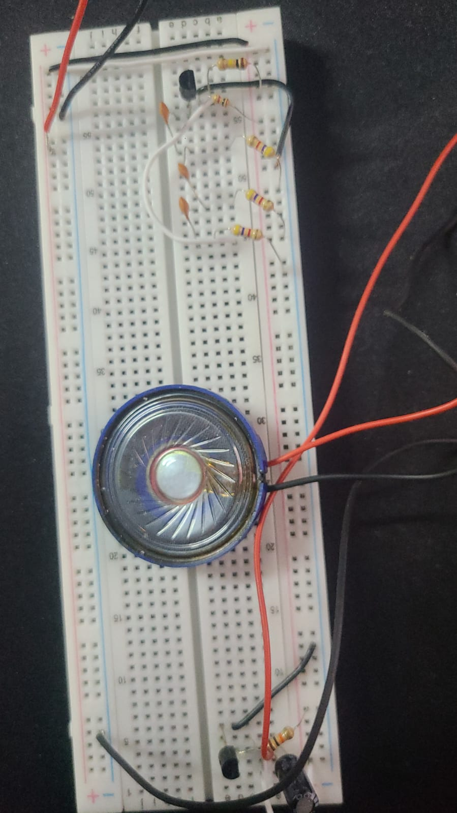

# 🔊 RC Phase Shift Oscillator
### Physics Semester Project | Analog Electronics

A discrete electronic circuit designed to generate a continuous audible sine wave signal (~500Hz). This project demonstrates the fundamental physics of oscillation, feedback loops, and phase manipulation using only passive components and transistors.

## 📖 Overview
Unlike digital synthesizers that use code to create sounds, this project generates a pure sine wave using **physics**. By manipulating the phase of an electrical signal through a specific arrangement of capacitors and resistors (an RC Ladder), we create a self-sustaining loop of energy—converting DC power from a battery into an AC audio signal.

## 🎯 Objectives
- **Design** a loop that satisfies the **Barkhausen Criterion** for oscillation.
- **Implement** a 3-stage RC ladder network to shift signal phase by 180°.
- **Amplify** the signal using a Common Emitter NPN Transistor configuration.
- **Drive** an 8-ohm speaker to make the oscillation audible.

## 🧰 Hardware Components
| Component | Specs | Qty | Role |
| :--- | :--- | :--- | :--- |
| **Transistor** | BC547 (NPN) | 2 | Amplification & Driver Stage |
| **Resistor** | 4.7kΩ | 3 | Phase Shift Network |
| **Capacitor** | 27nF | 3 | Phase Shift Network |
| **Resistors** | 10k, 1k, 100k | - | Biasing & Stability |
| **Speaker** | 8Ω (0.5W) | 1 | Audio Output |
| **Power** | 9V Battery | 1 | Power Source |

## ⚡ How It Works (The Physics)
The circuit relies on **Positive Feedback**. For oscillation to occur, two conditions must be met:
1.  **Loop Gain ≥ 1**: The signal must be amplified enough to overcome energy losses in the wires.
2.  **Phase Shift = 360°**: The output signal must be fed back into the input *in phase*.

### The 360° Loop
1.  **The Transistor (180°):** A Common Emitter amplifier naturally inverts the signal, creating the first 180° shift.
2.  **The RC Ladder (180°):** We use three identical RC stages. At our target frequency, each stage delays the signal by ~60°.
    > 60° + 60° + 60° = 180°
3.  **Total Shift:** 180° (Amp) + 180° (RC) = **360°** (Back to start!)

## 📐 Frequency Calculation
The frequency of oscillation is determined by the values of the Resistors (R) and Capacitors (C) in the feedback network using this physics formula:

$$f = \frac{1}{2\pi R C \sqrt{6}}$$

**Our Values:**
- **R** = 4.7kΩ (4700Ω)
- **C** = 27nF (0.000000027 F)

**The Result:**
$$f = \frac{1}{2\pi (4700) (27 \times 10^{-9}) (2.45)} \approx \mathbf{512 \text{ Hz}}$$

## 📸 Circuit & Prototype

## 🧪 Results
- **Theoretical Frequency:** 512 Hz
- **Observed Output:** Stable mid-range audio tone (Beep).
- **Stability:** The circuit requires precise component values. Using 27uF instead of 27nF resulted in no oscillation, confirming the sensitivity of the RC time constant.

## 📚 References
1. *Electronic Devices and Circuit Theory* - Boylestad & Nashelsky.
2. *HyperPhysics: Phase Shift Oscillator* - Georgia State University.

---
**Author:** M.sohair Khan
**Institution:** Sir Syed University of Engineering & Technology
